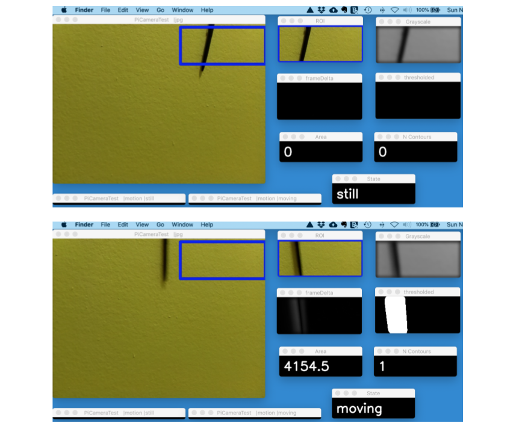

===================================================
imagenode: Capture and Send Images and Sensor Data
===================================================

Introduction
============

**imagenode** enables Raspberry Pi computers to capture images with the
PiCamera, perform image transformations and send them to a central **imagehub** for
further processing. It can also send other sensor data such as temperature data
and GPIO data. The processing power of the Raspberry Pi is used to detect
events (like the water meter flowing or a coyote crossing the back yard), and
then send a limited number of images of the event. It also works on other types
of (non Raspberry Pi) computers with USB cams or webcams.

Here are a couple of screenshots showing images sent by a Raspberry Pi PiCamera
and displayed on a Mac. In the top screenshot, a ballpoint pen hanging from a
string is still. In the bottom screenshot, the ballpoint pen is swinging back
and forth. The largest image in each screenshot is the full frame sent by the
PiCamera. The smaller windows are showing the **imagenode** motion detector
parameter tuning displays including the detected motion state of "still" and
"moving":

.. contents::

Overview
========

**imagenode** is the image capture and sending portion of a computer vision
pipeline that is typically run on multiple computers. For example, a Raspberry
Pi computer runs **imagenode** to capture images with a PiCamera and perform
some simple image processing. The images are transferred by **imagezmq** (see
reference) to a hub computer running **imagehub** (often a Mac) for further
image processing. The real benefit of **imagenode** is that it can use the
the processing power of the Raspberry Pi to:

- Continuously capture images (around 10 frames a second is typical)
- Analyze the images to detect events (e.g., water meter started flowing)
- When a detected event occurs:

  - Send an event message about the event to the imagehub
  - Send a select few "detected state change" images to the imagehub

So, instead of 36,000 images an hour being sent from our water meter cam to our
**imagehub**, only about 20 images are sent each time the water starts flowing
or stops flowing. Instead of many thousands of images an hour showing a mostly
unmoving farm area, our critter cams spot coyotes, raccoons and rabbits and only
send event messages and images when something is actually seen moving about.

**imagenode** provides image capture, event detection and transmission services
as part of a distributed computer vision system that includes multiple
computers with cameras, sensors, database hubs and communication links.
See `Using imagenode in distributed computer vision projects <docs/imagenode-uses.rst>`_
for a more detailed explanation of the overall project design. See the
`Yin Yang Ranch project <https://github.com/jeffbass/yin-yang-ranch>`_
for more details about the architecture of the
**imagenode** <--> **imagezmq** <--> **imagehub** system.

Imagenode Capabilities
======================

- Continuously captures images using PiCameras or USB webcams.
- Performs image transformation and motion, light or color detection.
- Sends detected events and relevant images to an image hub using **imagezmq**.
- Can capture and send other sensor data gathered using the GPIO pins.
- Can control lighting (e.g., white LED or Infrared LED area lights).
- Sends event messages (e.g., water is flowing) as well as images.

Dependencies and Installation
=============================

**imagenode** has been tested with:

- Python 3.6 and newer
- OpenCV 3.3 and 4.0 and newer
- Raspbian Stretch, Raspbian Jessie and Raspbian Buster
- PyZMQ 16.0 and newer
- RPi.GPIO 0.6 and newer (imported only if using GPIO pins)
- picamera 1.13 (imported only if using PiCamera)
- imagezmq 1.1.1 and newer
- imutils 0.4.3 and newer (used get to images from PiCamera)
- psutil 5.7.2 and newer
- PyYAML 5.3 and newer
- w1thermsensor 1.3 and newer (if using DS18S20 temperature sensor)
- adafruit-circuitpython-dht 3.4.2 and newer (if using DHT11 or DHT22 sensor)

**imagenode** captures images and uses **imagezmq** to transfer the images.
It is best to install and test **imagezmq** before installing **imagenode**.
The instructions for installing and testing **imagezmq** are in the
`imagezmq GitHub repository <https://github.com/jeffbass/imagezmq.git>`_.

**imagenode** is still in early development, so it is not yet in PyPI. Get it by
cloning the GitHub repository::

    git clone https://github.com/jeffbass/imagenode.git

Once you have cloned **imagenode** to a directory on your local machine,
you can run the tests using the instructions below. The instructions assume you
have cloned both **imagehub** and **imagezmq** to the user home directory.

Imagenode settings via YAML files
=================================

**imagenode** requires a *LOT* of settings: settings for the camera, settings
for the GPIO pins, settings for each detector and each ROI, etc. The settings are
kept in a YAML file and are changed to "tune" the image capture, ROIs, motion
detection and computer vision parameters. An example YAML file is included in
the "yaml" directory. An explanation of the yaml file and how to adjust the settings
is in `imagenode Settings and YAML files <docs/settings-yaml.rst>`_.

Running the Tests
=================

**imagenode** should be tested in stages, with each stage testing a little more
functionality. The tests are numbered in the order in which they should be run
to determine if **imagenode** is running correctly on your systems.

Test **imagenode** in the same virtualenv in which you tested **imagenzmq**. For
the **imagezmq** testing and for the **imagenode** testing, my virtualenv is
called py3cv3.

**imagenode** requires **imagezmq** be installed and working. Before running any
tests with **imagenode**, be sure you have successfully installed **imagezmq**
and run all of its tests. The **imagezmq** tests must run successfully on every
computer you will be using **imagenode** on. You can use pip to install
**imagezmq**.

Directory Structure for running the tests
-----------------------------------------
**imagenode** is not far enough along in development
to be pip installable. So it should both be git-cloned to any computer that
it will be running on. I have done all testing at the user home
directory of every computer. Here is a simplified directory layout::

  ~ # user home directory
  +--- imagenode.yaml  # copied from one of the imagenode yaml files & edited
  |
  +--- imagenode    # the git-cloned directory for imagenode
       +--- sub directories include docs, imagenode, tests, yaml

This directory arrangement, including docs, imagenode code, tests, etc. is a
common development directory arrangement on GitHub. Using git clone from your
user home directory (either on a Mac, a RPi or other Linux computer) will
put the **imagenode** directories in the right place for testing. Each test
described below requires you to copy the appropriate ``testN.yaml`` file to
``imagenode.yaml`` in the user home directory as shown in the above directory
diagram. The ``receive_test.py`` program acts as the image hub test receiver for
each imagenode test. It must be started and running before running
``imagenode.py.``

Test 1: Running **imagenode** and **imagezmq** together on a Mac
-----------------------------------------------------------------
**The first test** runs both the sending program **imagenode** and the receiving
program ``receive_test.py`` (acting as a test hub) on
a Mac (or linux computer) with a webcam. It tests that the **imagenode** software
is installed correctly and that the ``imagenode.yaml`` file has been copied and
edited in a way that works. It uses the webcam on the Mac for testing. It uses a
"lighted" versus "dark" detector applied to a specified ROI.

Test 2: Sending a light detector stream of images from RPi PiCamera to a Mac
----------------------------------------------------------------------------
**The second test** runs **imagenode** on a Raspberry Pi, using ``receive_test.py``
(acting as a test hub) on a Mac (or Linux computer). It tests that the
**imagenode** software is installed correctly on the RPi and that
the ``imagenode.yaml`` file has been copied and edited in a way that works.
It tests that the **imagezmq** communication is working between the Raspberry Pi
and the Mac. It also tests the Picamera. It uses a "lighted" versus "dark"
detector applied to a specified ROI.

Test 3: Sending a motion detector stream of images from RPi PiCamera to a Mac
-----------------------------------------------------------------------------
**The third test** runs **imagenode** on a Raspberry Pi, using ``receive_test.py``
(acting as a test hub) on a Mac (or Linux computer). It is very similar to Test
2, except that it uses a "moving" versus "still" motion detector applied to a
specified ROI.

Test 4: Sending temperature readings from RPi temperature sensor to a Mac
-------------------------------------------------------------------------
**The fourth test** runs **imagenode** on a Raspberry Pi, using ``receive_test.py``
(acting as a test hub) on a Mac (or Linux computer). It allows testing of the
temperature sensor capabilities of **imagenode**. It requires setting up a
DS18B20 temperature sensor and connecting it appropriately to RPi GPIO pin 4.

The details of running the 4 tests are `here <docs/testing.rst>`_.

Running **imagenode** in production
===================================
Running the test programs requires that you leave a terminal window open, which
is helpful for testing, but not for production runs. I have provided an example
imagenode.sh shell script that shows how I start imagenodes for the production
programs observing my small farm. The key is to start the imagenode.py program
1) in the correct virtualenv and 2) as a background task that allows the program
to keep running when the terminal window is closed. There are multiple ways to
start the imagenode.sh program when the RPi starts: use cron, use screen, or use
the systemctl / systemd service protocol that linux currently uses for startup.
The best one to use is the one that you prefer and are familiar with, so I won't
make a specific recommendation here.

In production, you would want to set the test options used to print settings
to false; they are only helpful during testing. All errors and information
are sent to imagenode.log in the same directory as imagenode.py. You will
probably want the log to be in a different directory for production; the log
file location can be set by changing it in the logging function at the bottom
of the imagenode.py program file.

Additional Documentation
========================
- `More details on running the tests <docs/testing.rst>`_.
- `How imagenode works <docs/imagenode-details.rst>`_.
- `How imagenode is used in a larger project <docs/imagenode-uses.rst>`_.
- `Version History and Changelog <HISTORY.md>`_.
- `Research and Development Roadmap <docs/research-roadmap.rst>`_.
- `The imagezmq classes that allow transfer of images <https://github.com/jeffbass/imagezmq>`_.
- `The imagehub software that saves events and images <https://github.com/jeffbass/imagehub>`_.
- `The larger farm automation / computer vision project <https://github.com/jeffbass/yin-yang-ranch>`_.
  This project also shows the overall system architecture.

Contributing
============
**imagenode** is in early development and testing. I welcome open issues and
pull requests, but because the programs are still rapidly evolving, it is best
to open an issue for some discussion before submitting pull requests. We can
exchange ideas about your potential pull request how to best test your code.

Contributors
============
Thanks for all contributions big and small. Some significant ones:

+--------------------------+-----------------+----------------------------------------------+
| **Contribution**         | **Name**        | **GitHub**                                   |
+--------------------------+-----------------+----------------------------------------------+
| Initial code & docs      | Jeff Bass       | `@jeffbass <https://github.com/jeffbass>`_   |
+--------------------------+-----------------+----------------------------------------------+
| Added code and           |                 |                                              |
| documentation for        |                 |                                              |
| PiCamera settings        | Stephen Kirby   | `@sbkirby <https://github.com/sbkirby>`_     |
+--------------------------+-----------------+----------------------------------------------+
| Added DHT11 & DHT22      |                 |                                              |
| sensor capability        | Stephen Kirby   | `@sbkirby <https://github.com/sbkirby>`_     |
+--------------------------+-----------------+----------------------------------------------+
| Added multiple detectors |                 |                                              |
| per camera capability    | Stephen Kirby   | `@sbkirby <https://github.com/sbkirby>`_     |
+--------------------------+-----------------+----------------------------------------------+

Acknowledgments
===============
- **ZeroMQ** is a great messaging library with great documentation
  at `ZeroMQ.org <http://zeromq.org/>`_.
- **PyZMQ** serialization examples provided a starting point for **imagezmq**.
  See the
  `PyZMQ documentation <https://pyzmq.readthedocs.io/en/latest/index.html>`_.
- **OpenCV** and its Python bindings provide great scaffolding for computer
  vision projects large or small: `OpenCV.org <https://opencv.org/>`_.
- **imutils** is a collection of Python classes and methods that allow computer
  vision programs using OpenCV to be cleaner and more compact. It has a very
  helpful threaded image reader for Raspberry PiCamera modules or webcams. It
  allowed me to shorten my camera reading programs on the Raspberry Pi by half:
  `imutils on GitHub <https://github.com/jrosebr1/imutils>`_. **imutils** is an
  open source project authored by Adrian Rosebrock.
- The motion detection function detect_motion() borrowed a lot of helpful code
  from a motion detector
  `tutorial post <https://www.pyimagesearch.com/2015/06/01/home-surveillance-and-motion-detection-with-the-raspberry-pi-python-and-opencv/>`_
  by Adrian Rosebrock of PyImageSearch.com.
