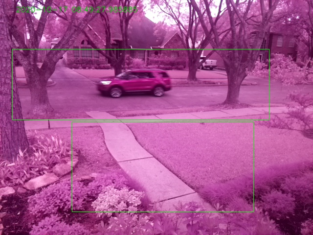

==============================================
imagenode Settings and the imagenode.yaml file
==============================================

.. contents::

Overview
========

**imagenode** is the image capture and sending portion of a computer vision
pipeline that is typically run on multiple computers. While the primary purpose is
to capture images from one or more cameras, **imagenode** can also gather
other sensor data using the GPIO pins as well as control lighting. All settings
are kept in a YAML file. To tune **imagenode** for a specific camera, ROI, etc.,
the YAML file is changed and the program is re-run to iteratively "tune" the
settings and optimize performance. There is a ``print_settings`` option in the
yaml file to print the settings. It can be very useful in catching spelling
errors or other errors in settings. There is no error checking of the settings
in the yaml file; many settings errors will cause a Python traceback error.
The Python traceback error will help identify what setting was problematic.
This is a design choice and is preferable to writing lots of settings checking
code (that could never catch everything anyway ;-)

Here is a imagenode.yaml file where many options have been specified:

.. code-block:: yaml

  # Settings file imagenode.yaml -- example with lots of settings
  ---
  node:
    name: JeffOffice
    queuemax: 50
    patience: 10
    stall_watcher: False
    heartbeat: 10
    send_type: jpg
    print_settings: False
  hub_address:
    H1: tcp://jeff-macbook:5555
    H2: tcp://192.168.1.155:5555
  cameras:
    P1:
      viewname: PiCameraView
      resolution: (640, 480)
      exposure_mode: night
      resize_width: 95
      framerate: 32
      vflip: True
      detectors:
        light:
          ROI: (65,2),(100,25)
          draw_roi: ((255,0,0),5)
          send_frames: detected event # or continuous or none
          send_count: 7
          threshold: 50
          min_frames: 5
          send_test_images: False
    W1:
      viewname: USBCamView
      resolution: (640, 480)
      resize_width: 80
      framerate: 32
      vflip: False
      src: 0
      detectors:
        motion:
          ROI: (70,2),(100,25)
          draw_roi: ((255,0,0),5)
          send_frames: continuous # or none or detected event
          send_count: 5
          delta_threshold: 5
          min_motion_frames: 4
          min_still_frames: 4
          min_area: 3  # minimum area of motion as percent of ROI
          blur_kernel_size: 21  # Guassian Blur kernel size
          send_test_images: True
  lights:
    L1:
      name: floodlight
      gpio: 18
      on: continuous
  sensors:
    T1:
      name: Temperature
      type: DS18B20
      gpio: 4
      read_interval_minutes: 1
      min_difference: 1

The above example has more options specified than is typical. But it does
show an actual yaml file that has been successfully used for testing
an RPi set up with a PiCamera, a USB webcam, a DS18B20 temperature sensor
and an LED light controlled by GPIO pin 18.

=============================
YAML file names and locations
=============================

The **imagenode** program expects its settings to be in a file named
``imagenode.yaml`` in the home directory.

This code repository comes with an ``yaml`` folder that contains multiple examples
for many settings. It is best not to change the example yaml files so that they
can be used as reference files. Copy a suitable yaml file to "imagenode.yaml"
in the home directory. On a Raspberry Pi computer, this is typically the "pi"
username's home directory. Edit the ``imagenode.yaml`` file to specify the
address of your hub computer and set other required and optional settings.

There is also a ``test.yaml`` file in the ``yaml`` folder. When doing the suggested
tests (see installation and testing section) this yaml settings file allows
the **imagenode** program imagenode.py to run on a Raspberry Pi computer while
a simple **imagezmq** test hub program runs on the Mac or other Linux computer.
It must be copied to ``imagenode.yaml`` in the home directory when being
used for testing. Be sure to edit the ``imagenode.yaml`` file to specify the
address of your hub computer. The other settings should be OK as is for testing.

Conventions used for settings
=============================

Settings follow YAML conventions. Most settings are dictionary key value pairs.
For example:

.. code-block:: yaml

  node: WaterMeter

There can be settings for multiple cameras, multiple temperature or other sensors
and multiple GPIO controlled lights. The example.yaml file shows 2 of each of
these. Each camera has a setting for full frame resolution (typically 640 x
480) and can also define multiple Regions of Interest (ROI). ROI corner locations
are **NOT** specified as pixels, but instead are specified as percentages of the
frame width or height (0 to 99). Specifying ROI corners as percentages of frame
resoltion allows the ROI corners to remain the same even if the resolution
of the full frame is changed. For example, changing framesize from (640 x 480) to
(320 x 240) won't require the ROI corner values to change if they are in
percentages instead of absolute pixels.

The example.yaml files shows how the settings are arranged. There is no error
checking of the settings; if a setting is not set to an expected value, then
a Python traceback error will result. This is adequate for debugging issues
with settings (mispelling a setting name, etc.) and saves writing a lot of
deeply nested if statements. You can also specify an option in the node settings
to print the settings; this can be helpful in spotting option mispellings, etc.

=======================================
Categories of Settings in the YAML file
=======================================

There are 5 settings categories at the root level of the yaml file:

.. code-block:: yaml

  node:  # specifies node name and operational settings like heartbeat interval
  hub_address:  # specifies 1 or more tcp address(es) for imagehub(s)
  cameras:  # specifies details for cameras (can be 0 or more)
  lights:  # specifies lights controlled by GPIO pins
  sensors:  # specifies sensors (like thermometers) and their GPIO pins

The ``node`` and ``hub_address`` settings groups are required and a traceback
error will be generated if they are not present or are misspelled.

Each of the other root level settings groups contains additional nested groups
that allow multiple settings. They can also be nested further as needed,
especially when specifying details of ROIs and detector parameters for the
camera(s). The entire yaml file is read into the settings.config dictionary,
when the Settings() class is called.  Then the root level items in the yaml
file are parsed in the Settings.__init__() method. Settings at more nested
layers below the root level are parsed in individual setup methods in the
``ImageNode()`` class. For example, the ``setup_cameras()`` method in the
ImageNode class sets up the PiCamera details, including resolution, framerate,
ROI setup, motion detector setup, etc. The 5 dictionaries at the root level of
the yaml file are described first below, then the more nested and detailed
settings in the yaml file are described.

node: Settings details
======================

The 1 required ``node`` setting is:

.. code-block:: yaml

  name: A descriptive node name (e.g. WaterMeter)

There is 5 optional ``node`` settings:

.. code-block:: yaml

  heartbeat: an integer number of minutes; how often to send a heartbeat to hub
  patience: maximum number of seconds to wait for a reply from imagehub
  stall_watcher: True or False to start a 'stall_watcher' sub-process
    (default is False)
  send_threading: True or False to send images & messages in a separate thread
  queuemax: maximum size of the queue for images, messages, etc.
  print_settings: True or False to print the settings from imagenode.yaml
    (default is False)
    (printing settings can be VERY helpful when debugging settings issues)
  send_type: jpg or image (default is jpg)

The ``heartbeat`` is an option that is specified by an integer number of
minutes. An event message is sent every (number) of minutes. The hearbeat
message is not logged as an event by the hub, unlike all the other event
messages. Since regular event messages may be very infrequent, (e.g., motion
events may happen hours or even days apart), a heartbeat message can keep
the WiFi or other network links active. Also, anytime a heartbeat message
fails to be acknowledged by the hub, the imagenode ``fix_comm_link`` function
will retry and try to correct the issue (restart the WiFi connection, restart
the ZMQ link, restart the Raspberry Pi itself, etc.). I have found heartbeat
messages helpful in testing and restarting network issues when the the option
is set to 10 minutes. Some of my Raspberry Pi imagenode cameras have run for
weeks without any heartbeat messages, but some have required 10 minute spaced
heartbeat messages in order to run reliably for even a couple of hours. If you
do not provide a ``heartbeat`` value, then no heartbeat messages will be sent.

The ``patience`` setting sets the maximum number of seconds for **imagenode**
to wait for a response from the hub. In typical operation, the communications
between **imagenode** and **imagehub** is reliable for weeks. The ZMQ protocol
can recover from brief network outages almost all of the time. But some network
outages (e.g., brief power outages that confuse routers or wifi hubs) can cause
the ZMQ protocol to hang. The ``patience`` setting specifies how long to wait
for a hub response before calling the ``fix_comm_link`` function that will retry
a non-responsive message and then try to correct the issue (restart the WiFi
connection, restart the ZMQ link, restart the Raspberry Pi itself, etc.). If
you do not specify an ``patience`` value, the default is 10 seconds.

If the ``stall_watcher`` setting is set to ``True``, then a sub-process is
started that watches the main process for "slow downs" or "stalls".
As mentioned in the above ``patience`` option, the communications link
between **imagenode** and **imagehub** is often reliable for weeks. The ZMQ protocol
can recover from brief network outages almost all of the time. But some network
outages (e.g., brief power outages that confuse routers or wifi hubs) can cause
the main process to stall and stop reading and transmitting images. Setting
this option to ``True`` will start a 2nd process that checks that the
cumulative cpu time of the main process is increasing as it should. If there
has been some sort of "stall", the main process cpu time stops advancing. If
the ``stall_watcher`` option is set to ``True``, the 2nd process will end the
**imagenode** program when a "stall" has been detected, so that the systemd
service can restart **imagenode**. An example **imagenode.service** file that
provides for restarting (using systemd / systemctl) is in the main directory.
The ``patience`` option (above) sets the number of seconds between "stall"
checks. If no ``patience`` value is provided, the default is 10 seconds. If
this option is set to ``False`` or is not present, there is no separate
stall watching process started.

If the ``send_threading`` setting is set to ``True``, then a separate thread
is started to send (message, image) pairs to the **imagehub**. The default is
``False``. When this setting is absent or ``False``, all camera reading and
(message, image) sending is done serially in the same forever loop (see
imagenode.py main loop). When the setting is ``True``, the ``send_q`` is an
instance of the SendQueue class, which causes the ``node.read_cameras()`` while
loop to run forever in the main program. No sending of (message, image) pairs is
done in the main program. Instead, the sending of (message, image) pairs
is done in a separate thread. This can result in somewhat higher FPS throughput.

The ``queuemax`` setting sets the length of the queues used to hold images,
messages, etc. Default is 50; setting it to a larger value will allow more
images to be stored and sent for each event, but will use more memory.

The ``send_type`` setting sets image transmission type. The **imagezmq**
possible transmission types are ``image`` (for full size uncompressed OpenCV
images) or ``jpg`` (for jpeg compressed images). The default is ``jpg`` because
it saves network bandwidth with minimal image information loss. The ``image``
setting will send unmodified OpenCV images, but they are very large compared to
jpg compressed images and should only be used when really needed.

hub_address: Settings details
=============================

There must be at least one hub address specified. If more than one hub
address is listed, the one labeled H1: will be used first, then if it fails
to respond, the one labeled H2: will be tried next, etc. Hub addresses have
the following formats:

.. code-block:: yaml

  H1: tcp://jeff-macbook:5555
  H2: tcp://192.168.1.155:5555
  H3: tcp://jeff-mac-air11:5555

The label H1 is required, even if there is only 1 hub address.

cameras: Settings details
=========================

Cameras are optional. While there is typically one camera (e.g., one PiCamera
is typically the only camera on a Raspberry Pi), it is also possible to have
multiple cameras. If there are no cameras, the cameras section of the YAML file
can be empty. For each camera, there are a variety of possible settings such as
those shown below:

.. code-block:: yaml

  P1:
    viewname: Window
    resolution: (640,480)
    exposure_mode: night
    framerate: 8
    iso: 800 # default = 0 for auto
    shutter_speed: 1500 # microseconds - default = 0 for auto
    vflip: False
    resize_width: 80
    send_type: jpg   # or image
    print_settings: True # default = False
    detectors:
      motion:
        ROI: (70,2),(100,25)
        draw_roi: ((255,0,0),5)
        send_frames: continuous # or none or detected event
        send_count: 5
        delta_threshold: 5
        min_motion_frames: 4
        min_still_frames: 4
        min_area: 3  # minimum area of motion as percent of ROI
        blur_kernel_size: 15  # Guassian Blur kernel size
        send_test_images: True
      light:
        ROI: (0, 0),(100, 100)  # This ROI is all of the image (in percent)
        draw_roi: ((255,0,0),1)   # Draws the box of the ROI with blue line
        send_frames: continuous   # or none or detected event
        send_count: 7
        threshold: 50
        min_frames: 5
        send_test_images: True

If there is a camera, the camera label ('P1' or 'W1' etc.) designates the camera
type. 'P1' designates a PiCamera. 'W1', 'W2', etc. designate webcams. Most other
settings are optional and provide camera specific settings.

Note that most webcams have preset fixed values for resolution, framerate,
etc. that cannot be changed. Check the docs for your webcam and test it with
cv2.VideoCapture(). PiCameras will typically use settings for resolution and
framerate, but many other settings, such as 'exposure_mode = sports' can be
set if needed. See the PiCamera readthedocs for the detailed API. There is a
section below specifically for PiCamera settings.

``viewname`` is an optional setting. It is required when there are multiple
cameras to give each one a unique viewname. For example, the node could be named
``JeffOffice`` and could have one camera with ``viewname: window`` and another
camera with ``viewname: door`` to distinguish the two cameras' fields of view.
Thus, one camera's images would be named 'JeffOffice window' and the other
camera's images would be named 'JeffOffice door'.

``resolution`` is an optional setting. It is specified as a tuple as shown
above. Typical values are (320, 240) and (640, 480). The default if none is
specified is (320, 240).

``vflip`` is an optional setting. If the camera image needs to be vertically
flipped, set ``vflip: True``. The default if not present is ``False``.

``resize_width`` is an optional setting. It allows for resizing the image,
keeping the same aspect ratio, but reducing the image size by specifying the
desired width. The width is an integer percentage value from 0 to 99.
For example, ``resize_width: 80`` would reduce the width 80%, and the height
proportionally, keeping the same aspect ratio.

``send_frames`` is an optional setting. If set to ``continuous``, then images
are sent continuously as they are read from the camera. If set to ``event``
then images are sent when an event occurs, such as motion detected or a light
level change detected. If set to ``none``, then images are never sent from the
camera. For example, if ``send_frames`` is set to ``none``, and a motion
detector is specified, then motion event messages will be sent when motion is
detected, but images will not be sent.

``src`` is an optional setting that only applies to webcams, not PiCameras. If
a webcam is being specified, ``src`` is set to 0 or 1 or 2, etc. This value is
passed along to cv2.VideoCapture() to select a webcam. The value defaults to 0,
which is the first webcam detected. If you have more than one webcam, you should
set the ``src`` value to the next integer for each webcam. You may have to do
some testing to determine which cv2.VideoCapture(src) value is assigned to which
webcam.

PiCamera Specific Settings
--------------------------

There a many camera settings available on PiCameras, including the ability to
set an automatic exposure mode such as ``night`` or ``sports``. There are also
a number of very "manual" PiCamera settings, such as ``iso`` and
``shutter_speed``. The details of these exposure modes are in the
`PiCamera readthedocs <https://picamera.readthedocs.io/en/release-1.10/api_camera.html>`_.
You can also type ``raspistill --help`` at a CLI prompt on a
Raspberry Pi computer for a list of these settings and allowed values.

Below is the list of PiCamera specific settings that can be specified in the
YAML settings file. A couple of these, ``iso`` and ``shutter_speed`` are
shown in the example above.

``awb_mode`` retrieves or sets the auto-white-balance mode of the camera.
The default value is ``auto``.  The other possible values are:
``off, auto, sunlight, cloudy, shade, tungsten, fluorescent, incandescent,
flash, horizon``.

``awb_gains`` is an optional setting for the auto-white-balance gains of the
camera.  When queried, the output is expressed as Fraction instances of
a (red, blue) tuple. Typical values for the gains are between 0.9 and 1.9,
and this attribute only has an effect when ``awb_mode`` is set to ``off``.

``brightness`` is an optional setting for the brightness of the camera.
The default value is ``50``, and the value can be set to an integer between 0
and 100.

``contrast`` is an optional setting for the contrast of the camera.
The default value is ``0``, and the value can be set to an integer between
-100 and 100.

``exposure_compensation`` is an optional setting for adjusting the exposure
compensation level. Each increment represents 1/6th of a stop. Hence, setting
the attribute to 6 increases exposure by 1 stop. The default value is ``0``,
and the value can be set to an integer between -25 and 25.

``exposure_mode`` retrieves or sets the PiCamera's automatic
exposure_mode. The default is ``auto``. The possible values are:
``off, auto, night, nightpreview, backlight, spotlight, sports, snow, beach,
verylong, fixedfps, antishake, fireworks``.

``iso`` retrieves or sets the apparent ISO setting of the camera. This setting
behaves differently for camera module versions V1 and V2. Only the V2 camera
modules are calibrated against the ISO film speed standards.
The default is ``0`` for automatic ISO setting. Allowed falues are:
``0, 100, 200, 320, 400, 500, 640, 800``.

``meter_mode`` is an optional setting used to adjust the camera's metering mode.
All modes set up two regions: a center region, and an outer region. The major
difference between each mode is the size of the center region. The ``backlit``
mode has the largest central region (30% of the width), while ``spot`` has the
smallest (10% of the width). The default value is ``average``, and the other possible
values include the following: ``average, spot, backlit, matrix``.

``saturation`` is an optional setting to adjust the saturation of the camera.
The default value is ``0``, and the value can be set to an integer between -100
and 100.

``sharpness`` an optional setting to adjust the sharpness of the camera.
The default value is ``0``, and the value can be set to an integer between -100
and 100.

``shutter_speed`` is an optional setting for the shutter speed in microseconds.
The default value is ``0`` for auto, and the value can range as an integer from
0 to 33,333 microseconds (depending on the camera module firmware).

PiCamera Read-Only Parameters
-----------------------------

The following read-only parameters can be retrieved by using
``print_settings = True`` in the ``node`` section of the ``imagenode.yaml`` file.

``analog_gain`` retrieves the current analog gain of the camera. The value is
returned as a ``Fraction`` instance (read-only).

``digital_gain`` retrieves the current digital gain of the camera. This
parameter returns the digital gain currently used by the camera. It provides
valuable feedback on the effects of varying other PiCamera parameters (read-only).

``exposure_speed`` retrieves the current shutter speed of the camera.
If the ``shutter_speed`` was set to a non-zero value, then ``exposure_speed`` will
equal ``shutter_speed``. The is returned in microseconds (read-only).

``revision`` returns a string representing the revision of the Pi’s camera
module. The read-only values returned include the following:
``ov5647 = V1, imx219 = V2, imx477 = HQ``.

See the "Camera Detectors, ROI and Event Tuning" section below for details on
how detectors, events and related settings are defined and implemented for each
camera.

======================================
Camera Detectors, ROI and Event Tuning
======================================

Cameras can be used to capture and send images continuously, but that takes a
lot of network bandwidth and is likely to send a lot of "boring, repetitious and
often useless" images. While ``continuous`` is indeed a valid camera ``send_frames``
setting, it is more common and useful to send images only when some event is
detected. Was motion detected in a certain ROI? Did the light in the garage
come on? Did the water meter needle move? There are settings for detectors that
can specify how events are detected. The code and the yaml file for **imagenode**
detectors and event tuning is continuously evolving, but three detectors that we
use often are ``light``, ``motion`` and ``color``.

At least one detector must be specified.  The simplest detector is the **light**
detector and is the one that is used for camera positioning and testing. It is
also the one that is used for running the tests described in the README. It is
possible to specify multiple detectors, such as both a light detector and a
motion detector. Sometimes it is helpful to specify multiple motion detectors
with different ROI's and different thresholds to cover different parts of
the imaging area.

The ROI for a detector is a rectangle within the image that will be used by
the detection algorithm. For a motion detector, the ROI coordinates define the
rectangle in which to detect motion. For a light detector, the ROI coordinates
define the rectangle in which to count pixels that are above some light (pixel
intensity) value. Specifying an ROI is optional; if no ROI is explicitly
specified, then the entire image is used as the ROI.

ROIs are specified the same way that OpenCV specifies rectangles for drawing,
except that corners are specified in percentages of full frame pixels rather
than raw pixels. You specify an ROI rectangle by providing the coordinates of
the top left corner, followed by the coordinates of the bottom right corner.
Each corner is a tuple where the first number specifies the distance from the
left edge of the frame and the second value specifies the distance from the top
edge of the frame.

These numbers are given in integer percent values (0 to 100) of the image size.
See the above section called "Conventions used in settings" for an explanation
of the use of percentages versus absolute pixel coordinate values.

For example, if the original image size is 640 x 480, then:

- ((0,0),(100,100)) would specify an ROI that is the full image. This is the
  default ROI if no ROI is explicitly specified.

- ((40,40),(60,60)) would specify an ROI in the center that stretches from 40
  percent to 60 percent in each dimension. In pixels, that would be
  ((256,192),(384,288)) for an original image size of 640 x 480.

- ((15,30),(70,85)) would specify an ROI rectangle with the upper left corner at
  15 percent from the left of the frame and 30 percent from the top of the
  frame. The lower right corner would be 70 percent from the left of the frame
  and 85 percent from the top of the frame. In pixels, that would be
  ((96,144),(448,408)) for an original image size of 640 x 480.

A detector can also draw the ROI rectangle onto the images that are sent by
specifying the color of the rectangle and the pixel width of the drawing line.
For example:

.. code-block:: yaml

  draw_roi: ((255,0,0),5)

would draw the ROI rectangle on the sent images as a blue line that is 5 pixels
wide. The syntax for specifying the rectangle color and line width is the same
as the cv2.rectangle() drawing function. The cv2.rectangle() drawing function
is used to draw the rectangle on each image before sending.

Settings for the **light** detector
===================================

The **light** detector type sends an event message (and event image frames) when
an ROI changes from dark to lighted or from lighted to dark. There are 2 states
detected by the light detector: "dark" and "lighted".

Here is an example of the **light** detector settings:

.. code-block:: yaml

  detectors:
    light:
      ROI: ((10,35),(40,85))
      draw_roi: ((255,0,0),5) # draw ROI rectangle with blue 5 pixel line
      threshold: 25
      percent: 70
      min_frames: 5
      send_frames: detected event  # or continuous or none
      send_count: 5
      send_test_images: False

Intensity, pixel intensity, and brightness are all synonyms for how much light is
captured by the camera. The light detector is used to measure light versus
dark in the specified ROI. Knowing how many pixels are above a
specified value can tell us if the ROI is lighted or dark.  This can be useful in
a variety of applications. For example, one way to tell if a typical garage door
has been opened or closed is to watch for the garage to become lighted, because
most garage door openers turn on a garage light when the garage door is opened.

All images are converted to grayscale before light value detection.

The **light** detector needs to have 3 values provided:

1. threshold: an intensity threshold value (0 to 255) that is "bright enough" to
   count as lighted. Any pixel intensity value equal to or greater than the
   threshold value will cause that pixel to be counted as "lighted". Any pixel
   intensity value less than the threshold value will be counted as "dark".
2. percent: the percentage of pixels in the ROI that must exceed the
   threshold intensity value in order to declare the ROI state as "lighted". If
   fewer than this percentage of pixels exceeds the Threshold, then the ROI state
   is "dark".
3. min_frames: the minimum number of frames that counts as a change of state.
   This specifies how many frames must exceed the threshold and percent values
   in order to change the state from "lighted" to "dark" or vice versa. This
   setting can be adjusted to prevent minor light transients from causing a
   "flickering" of the state. Setting this number higher will make the
   state change less sensitive to transient light changes, but also make it take
   longer to detect a change. A typical value would be 5 frames. The default
   value is 5 frames.

For example,

.. code-block:: yaml

  threshold: 25
  percent: 40
  min_frames: 5

would mean that 40 percent of the pixels in the ROI would need to have a pixel
intensity of 25 or greater to detect a state of "lighted". If less than 40
percent of pixels had a pixel intensity of 25 or greater, then the state would
be "dark". A minimum of 5 frames must exceed the threshold for the state to
change.

Additional methods for "detecting light" may be added later. For example, an
intensity detector may compare average pixel intensity **in** the ROI to average
pixel intensity **outside** the ROI. If you have ideas for other light intensity
detectors, open an issue or pull request.

There are 3 additional options that don't affect how motion is detected, but do
affect how it is recorded:

1. send_frames: How images should be sent to the hub. Options are:

   - "detected event": this will send "send_count" frames when the state changes
     from "still" to "moving" or vice versa.
   - "continuous": this will send images to the hub continuously and is used for
     testing option settings. It allows the hub to display images in real time.
     It is most often used with the send_test_images option.
   - "none": this will send no images to the hub at all. It is used when all
     that is desired is event messages and images aren't needed. It can save
     network bandwidth for simple motion detection tasks.
2. send_count: how many images to send when an event occurs.
3. send_test_images: Set to True, this will send additional test images for
   viewing the effect of option setting changes. The additional test images that
   are sent are ROI, ROI grayscale, ROI frameDelta (showing the pixel differences
   between the current image and the average of past images) and the ROI
   thresholded image where all the frameDelta pixels are thresholded to black
   or white per the delta_threshold option. Watching the continuous frames and
   these additional test images improves tuning the options to the desired
   motion detection level.

Settings for the **motion** detector
====================================

The ``motion`` detector settings are more complex:

.. code-block:: yaml

  detectors:
    motion:
      ROI: (70,2),(100,25)
      draw_roi: ((255,0,0),5)
      delta_threshold: 5
      min_motion_frames: 4
      min_still_frames: 4
      min_area: 3  # minimum area of motion as percent of ROI
      blur_kernel_size: 21  # Guassian Blur kernel size
      send_frames: detected event # or continuous # or none
      send_count: 5
      send_test_images: False

The motion detector watches the ROI for motion by comparing the most recent
image to an average of previous images. The code for the detector is adapted
from a motion detector tutorial post by Adrian Rosebrock on PyImageSearch.com.
See README.rst for a link to that post.

The motion detector detects 2 states, ``moving`` and ``still``. An event is
sent (as an event message and some event images) whenever the motion state
changes. The detector is setup to send only a few images (determined by the
``send_count`` option) at each state change. This is a specific design choice.
For example, when a water meter needle starts moving, it is sufficient to send a
few frames when then needle starts moving and to send a few frames when it stops moving.
The continuous sending of frames during needle movement does not add any useful
information. Some motion detection software sends all frames when motion is
detected; the current **imagenode** motion detector doesn't do that (but the
code could be changed to make it behave that way).

All images are converted to grayscale before motion detection is done.

There are 5 options to tune the motion detector:

1. delta_threshold: the minimum intensity difference between the current image
   and the weighted average of past images required to count a given pixel as
   'motion'. Smaller values cause more motion to be detected. Larger values will
   cause less motion to be detected. Typical values are 3 to 10.
2. min_area: How much of the ROI has to have pixels show motion to cause the
   change to the "moving" state. This is specified as a percent of ROI and the
   value varies widely depending on ROI size, motion type, etc.
3. blur_kernel_size: Images are "blurred" using the OpenCV GaussianBlur method.
   This option chooses the kernel size in pixels. Typical values are 5 to 23.
4. min_motion_frames: The minimum number of frames with detected motion to change
   the state to "moving". Typical values are 3 to 7 frames of motion.
5. min_still_frames: The minimum number of frames with no detected motion to
   change the state to "still". Typical values are 3 to 7 frames of no motion.

All of these values are tuned to get the motion detection results that are
desired. There is a send_test_images option that allows real time viewing
of the intermediate computed ROI values so you can try different values and
see which ones best track the motion you are trying to detect. Tuning is a
trial and error process of changing the option values and watching the various
intermediate images sent by the send_test_images option.

For example,

.. code-block:: yaml

  delta_threshold: 25
  min_area: 40
  blur_kernel_size: 15
  min_motion_frames: 5
  min_still_frames: 3

would mean that the newest image pixel intensity value would be subtracted from
the weighted average pixel of past images, and the absolute value of that
difference would need to be greater than 25 for the pixel to be counted as
"moving". A minimum of 40 percent of the pixels would have to have that
difference to count the frame as "moving". The image would be blurred with a
kernel size of 15, and a minimum of 5 frames in a row would have to be detected
as "moving" for the state to change to "moving". Once there was a state of
"moving", a minimum of 3 frames would need to have no motion detected to change
the state to "still".

There are 3 additional options that don't affect how motion is detected, but do
affect how it is recorded:

1. send_frames: How images should be sent to the hub. Options are:

   - "detected event": this will send "send_count" frames when the state changes
     from "still" to "moving" or vice versa.
   - "continuous": this will send images to the hub continuously and is used for
     testing option settings. It allows the hub to display images in real time.
     It is most often used with the send_test_images option.
   - "none": this will send no images to the hub at all. It is used when all
     that is desired is event messages and images aren't needed. It can save
     network bandwidth for simple motion detection tasks.
2. send_count: how many images to send when an event occurs.
3. send_test_images: Set to True, this will send additional test images for
   viewing the effect of option setting changes. The additional test images that
   are sent are ROI, ROI grayscale, ROI frameDelta (showing the pixel differences
   between the current image and the average of past images) and the ROI
   thresholded image where all the frameDelta pixels are thresholded to black
   or white per the delta_threshold option. Watching the continuous frames and
   these additional test images improves tuning the options to the desired
   motion detection level.

Specifying **Multiple** Camera Detectors of the Same Type
=========================================================
Multiple Regions of Interest (ROI) are possible with the same detector. For example,
if a region, such as the sidewalk approaching your front door, is of special interest,
this region can be defined and named in order to generate log notifications for that
specific ROI.

In the example yaml file below, a log event will be generated indicating motion at the
FrontDoor (e.g. "**2020-10-16 20:53:39,727 ~ StreetView RPiCam6|motion|moving|FrontDoor**").
When using duplicate detector types, such as motion, each detector entry must be preceeded
by a '-' and space as shown below. Each detector section must have a ``roi_name`` and
``log_roi_name`` parameter.  Log events these ROIs will have the ``roi_name`` concatenated
to the end of each associated event in the log file if the ``log_roi_name`` is
enabled (default: False).

.. code-block:: yaml

	# Settings for imagenode.py webcam motion detector testing
	---
	node:
	  name: StreetView
	  queuemax: 50
	  patience: 15
	  heartbeat: 1
	  send_type: jpg
	  #send_threading: True  # sends images in separate thread
	  #stall_watcher: True  # watches for stalled network or RPi power glitch
	  print_settings: True
	hub_address:
	  H1: tcp://10.0.0.228:5555
	cameras:
	  P1:
		viewname: RPiCam6
		resolution: (640,480)
		exposure_mode: auto
		framerate: 30
		detectors:
		  - motion:
			 ROI: (4,21),(86,51)
			 roi_name: Street
			 log_roi_name: False # default False
			 draw_roi: ((0,255,0),1)
			 send_frames: detected event # continuous, none or detected event
			 send_count: 7 # number of images to send when an event occurs
			 delta_threshold: 7
			 min_motion_frames: 5
			 min_still_frames: 5
			 min_area: 3
			 blur_kernel_size: 21
			 send_test_images: False
			 print_still_frames: False  # default = True
			 draw_time: ((0,200,0),1)
			 draw_time_org: (5,5)
			 draw_time_fontScale: 0.5
		  - motion:
			 ROI: (23,52),(81,90)
			 roi_name: FrontDoor
			 log_roi_name: True  # default False
			 draw_roi: ((0,255,0),1)
			 send_frames: detected event # continuous, none or detected event
			 send_count: 7 # number of images to send when an event occurs
			 delta_threshold: 7
			 min_motion_frames: 5
			 min_still_frames: 5
			 min_area: 3  # minimum area of motion as percent of ROI
			 blur_kernel_size: 21  # Guassian Blur kernel size - integer and odd
			 send_test_images: False
			 print_still_frames: False  # default = True

Note:  If multiple detectors are used of different types (e.g. motion and light),
then the '-' and space is not required. However, mixed syntax is not allowed. In other words,
each detector must have a '-' and space or NOT, unless duplicate types are used,
and in that case each detector must have a '-' and space preceding each entry.

=========================================================================
Settings for Sensor Detectors, including temperature and humidity sensors
=========================================================================

Raspberry Pi computers can have various sensors attached to the GPIO pins.
The two types I have used are the DS18B20 "1 wire" temperature sensors and the
DHT temperature / humidity sensors. There is ongoing testing other kinds of
sensors such as PIR (passive infrared) sensors for motion detection. That code
will be added to the repository when it has been more thoroughly tested. Sensors
use the RPi.GPIO module and can only be run on Raspberry Pi computers.

There are 5 options to set when using DS18B20 or DHT22 sensors:

.. code-block:: yaml

  sensors:
    T1:
      name: Temperature
      type: DS18B20
      gpio: 4  # note that the DS18B20 can only be used on GPIO pin 4
      read_interval_minutes: 10  # check temperature every X minutes
      min_difference: 1  # send reading when changed by X degrees
    T2:
      name: Temperature & Humidity
      type: DHT22
      gpio: 18
      read_interval_minutes: 10  # check temperature every X minutes
      min_difference: 1  # send reading when changed by X degrees

1. name: This is a descriptive name for the sensor.
2. type: DS18B20, DHT11 and DHT22 are the currently supported sensors.
3. gpio: Which GPIO pin reads the sensor. Pin 4 must be
   used for "one-wire" sensors like the DS18B20. Any GPIO pin can be used for
   DHT11 or DHT22 sensors.
4. read_interval_minutes: How often the sensor measurements should be read,
   specified in minutes
5. min_difference: The minimum change from the last reading that
   will cause an event message to be sent to the hub. Typically set to 1 or 2
   degrees. The setting will apply to humidity minimum change on DHT11 or DHT22
   sensors.

When the sensor takes a reading that meets the ``min_difference`` requirement,
a message of this format is placed into the ``send_q`` for sending to the hub::

  Barn |temperature | 75 F
  Deck |temperature | 75.4 F
  Deck |humidity | 48.4 %

The temperature readings are not taken during the main event loop that captures,
processes and sends images. Instead, the check_temperature() function runs in  a
separate Python thread that reads the temperature sensor
at intervals specified by the ``read_interval_minutes`` option.

===============================================
Settings for Lights controlled by the GPIO pins
===============================================

Raspberry Pi PiCameras often use supplemental lighting, which is controlled
using the GPIO pins on the RPi. For example, in our water meter motion detector,
there are a set of LEDs that light up the water meter. They are controlled by
the Raspberry Pi computer GPIO pins. The GPIO pins don't typically power the
LEDs directly, but instead use some electronic switch (such as an N channel
MOSFET) to turn on the LEDs.

There are 3 options to set up the GPIO pins:

.. code-block:: yaml

  name: floodlight
  gpio: 18
  on: continuous

1. name: name of the light, e.g., "floodlight" or "overhead spotlight"
2. gpio: Which GPIO pin is used to signal the LED electronic switching device
3. on: When to turn on the LEDs. Settings include:

   - continuous
   - timed: times of day to have lights turn on and off

There can be multiple lights specified, but each one would require a different
gpio pin to be specified as well.

Additional methods of controlling lights are in development, such as
testing for an average image brightness level to turn on a light. For example,
a light could be turned on if the brightness level of the camera field of view
drops to a dark value.

`Return to main documentation page README.rst <../README.rst>`_
